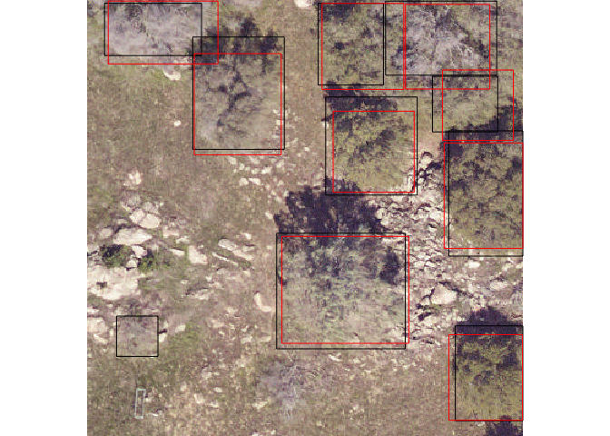

<!-- README.md is generated from README.Rmd. Please edit that file -->
NeonTreeEvaluation
==================

[](https://travis-ci.org/%3CUSERNAME%3E/%3CREPO%3E)

The goal of NeonTreeEvaluation is to automate testing against the NEON Tree Detection Benchmark

Submission Format
=================

The format of the submission is as follows

-   A csv file
-   5 columns: Plot Name, xmin, ymin, xmax, ymax

Each row contains information for one predicted bounding box.

The plot column should be named the same as the files in the dataset (e.g. SJER\_021)

``` r
library(NeonTreeEvaluation)
library(dplyr)
submission<-read.csv(system.file("extdata", "Weinstein2019.csv",package = "NeonTreeEvaluation"))
head(submission)
#>   plot_name       xmin       ymin     xmax      ymax
#> 1  BLAN_005 299.532560  13.216835 396.9573 123.17089
#> 2  BLAN_005   6.189451 217.012850 113.7897 325.25092
#> 3  BLAN_005 255.822100 181.132950 309.3961 245.84946
#> 4  BLAN_005 256.380600 283.993260 334.1573 376.96796
#> 5  BLAN_005 107.644630   5.248255 177.9518  85.23382
#> 6  BLAN_005 173.360230 341.138150 255.3800 400.00000
```

Evalute just one plot

``` r
df<-submission %>% filter(plot_name=="SJER_052")
evaluate_plot(df)
#> [1] "/Users/Ben/Documents/NeonTreeEvaluation/SJER/plots/SJER_052.tif"
```



    #>   recall precision
    #> 1    0.9         1
