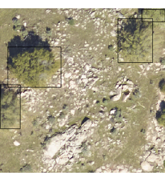

# A multi-sensor benchmark dataset for detecting individual trees in airborne RGB, Hyperspectral and LIDAR point clouds

Individual tree detection is a central task in forestry and ecology. Few papers analyze proposed methods across a wide geographic area. The NeonTreeEvaluation dataset is a set of bounding boxes drawn on RGB imagery for 22 sites in the National Ecological Observation Network (NEON). Each site covers a different forest type(e.g. [TEAK](https://www.neonscience.org/field-sites/field-sites-map/TEAK)). This dataset is the first to have consistant annotations across a variety of ecosystems for co-registered RGB, LiDAR and hyperspectral imagery.

Evaluation images are included in this repo under /evaluation folder.
Annotation files (.xml) are included in this repo under /annotations/

For the larger annotated training tiles, as well as unannotated  training tiles for additional sites, see zenodo [archive]()

Mantainer: Ben Weinstein - University of Florida.

# How do I evaluate against the benchmark?

We have built an R package for easy evaluation and interacting with the benchmark evaluation data.

https://github.com/weecology/NeonTreeEvaluation_package

# How were images annotated?

Each visible tree was annotated to create a bounding box that encompassed all portions of the vertical object. Fallen trees were not annotated. Visible standing stags were annotated. 


For the point cloud annotations, the two dimensional bounding boxes were [draped](https://github.com/weecology/DeepLidar/blob/b3449f6bd4d0e00c24624ff82da5cfc0a018afc5/DeepForest/postprocessing.py#L13) over the point cloud, and all non-ground points (height < 2m) were excluded. Minor cosmetic cleanup was performed to include missing points. In general, the point cloud annotations should be seen as less thoroughly cleaned, given the tens of thousands of potential points in each image.

# Sites ([NEON locations](https://www.neonscience.org/field-sites/field-sites-map/list))

| siteID, State  | Forest Description | Evaluation Annotations  |Training Annotations  |
|---|---|---|---|
|  SJER, CA |   Oak Savannah| 293   | 2533  |
|  TEAK, CA |   |   |   |
|   NIWO, CO|   |   |   |

# How can I add to this dataset?

Anyone is welcome to add to this dataset by cloning this repo and labeling a new site in [rectlabel](https://rectlabel.com/). NEON data is available on the [NEON data server](http://data.neonscience.org/home). We used the NEON 2018 “classified LiDAR point cloud” data
104 product (NEON ID: DP1.30003.001), and the “orthorectified camera mosaic” (NEON ID:
105 DP1.30010.001). Please follow the current folder structure, with .laz and .tif files saved together in a single folder, with a unique name, as well as a single annotations folder for the rect label xml files. See /SJER for an example.

For ease of access, we have added two unlabeled sites, [BART](https://www.neonscience.org/field-sites/field-sites-map/BART), and [UNDE](https://www.neonscience.org/field-sites/field-sites-map/UNDE), we encourage others to label these sites, or use models from the labeled data to predict into new, untested, areas.

# RGB

```R
library(raster)
library(NeonTreeEvaluation)

#Read RGB image as projected raster
rgb_path<-get_data(plot_name = "SJER_021",sensor="rgb")
rgb<-stack(rgb_path)

#Path to dataset
xmls<-readTreeXML(siteID="SJER")

#View one plot's annotations as polygons, project into UTM
#copy project utm zone (epsg), xml has no native projection metadata
xml_polygons <- boxes_to_spatial_polygons(xmls[xmls$filename %in% "SJER_021.tif",],rgb)

plotRGB(rgb)
plot(xml_polygons,add=T)
```



# Lidar

To access the draped lidar hand annotations, use the "label" column. Each tree has a unique integer.

```R
library(lidR)
path<-get_data("TEAK_052",sensor="lidar")
r<-readLAS(path)
trees<-lasfilter(r,!label==0)
plot(trees,color="label")
```


The same is true for the training tiles (see below)


We elected to keep all points, regardless of whether they correspond to tree annotation. Non-tree points have value 0. We  recommend removing these points before evaluating the point cloud. Since the annotations were made in the RGB and then draped on to the point cloud, there will be some erroneous points at the borders of trees.

# Hyperspectral 

Hyperspectral surface reflectance (NEON ID: DP1.30006.001) is a 426 band raster covering visible and near infared spectrum.

```R
path<-get_data("MLBS_071",sensor="hyperspectral")
g<-stack(path)
nlayers(g)
[1] 426
#Grab a three band combination to view as false color
g<-g[[c(17,55,113)]]
nlayers(g)
[1] 3
plotRGB(g,stretch="lin")
```


And in the training data:


## Training Tiles

We have uploaded the large training tiles to Zenodo for download. 

This includes

* The annotated trainings tiles (optionally cropped) for the NIWO, MLBS, SJER, TEAK, LENO, and OSBS sites. These site training tiles vary in size.

* Unannotated training tiles for the 15 additional sites. Training tiles do not overlap with evaluation plots.

**TODO add zenodo link.**

# Performance

To submit to this benchmark, please see 

https://github.com/weecology/NeonTreeEvaluation_package

The primary evaluation statistic is precision and recall across all sites. It is up to the authors to choose the best probability threshold if appropriate. 

| Author                | Precision | Recall | Description                              |   |
|-----------------------|-----------|--------|------------------------------------------|---|
| Weinstein et al. 2019 <sup>1</sup> | 0.55      | 0.65   | Semi-supervised RGB Deep Learning        |   |
| Silva et al. 2016     |       0.09    | 0.23        | Unsupervised LiDAR raster  |   |
| Dalponte et al 2016   |           |        | Unsupervised LidAR raster  |   |                      |   |
| Li et al. 2012        |           |        | Unsupervised LiDAR point cloud|                      |   |

To reproduce the analysis for the benchmark comparison see https://github.com/weecology/NeonTreeEvaluation_analysis

## Cited
<sup>1</sup> Weinstein, Ben G., et al. "Individual tree-crown detection in RGB imagery using semi-supervised deep learning neural networks." Remote Sensing 11.11 (2019): 1309. https://www.mdpi.com/2072-4292/11/11/1309
Thanks to the lidR R package for making algorithms accessible for comparison.

Please submit a pull request, or contact the mantainer if you use these data in analysis and would like the results to be shown here.
