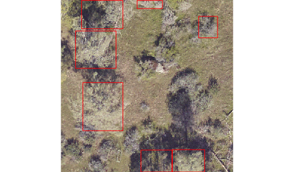
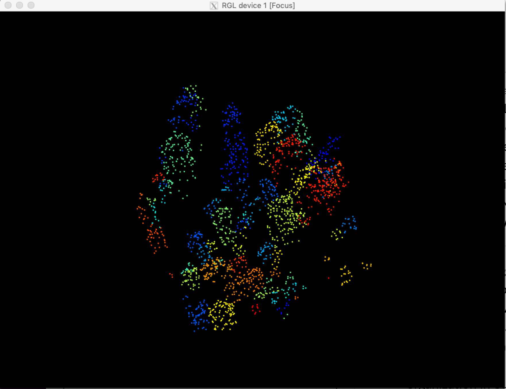
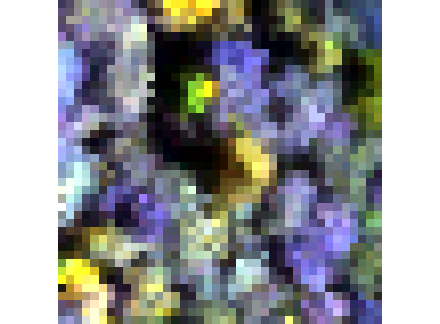

# A multi-sensor benchmark dataset for detecting individual trees in airborne RGB, Hyperspectral and LIDAR point clouds

Individual tree detection is a central task in forestry and ecology. Few papers analyze proposed methods across a wide geographic area. The NeonTreeEvaluation dataset is a set of bounding boxes drawn on RGB imagery for 22 sites in the National Ecological Observation Network (NEON). Each site covers a different forest type(e.g. [TEAK](https://www.neonscience.org/field-sites/field-sites-map/TEAK)). This dataset is the first to have consistant annotations across a variety of ecosystems for co-registered RGB, LiDAR and hyperspectral imagery. In total this repo holds 30975 Tree annotations.

Evaluation images are included in this repo under /evaluation folder.
Annotation files (.xml) are included in this repo under /annotations/

*Note: Not all plots in the evaluation folder contain annotations, many are unannotated to support future growth of the benchmark.*

Mantainer: Ben Weinstein - University of Florida.

# How do I evaluate against the benchmark?

We have built an R package for easy evaluation and interacting with the benchmark evaluation data.

https://github.com/weecology/NeonTreeEvaluation_package

# How were images annotated?

Each visible tree was annotated to create a bounding box that encompassed all portions of the vertical object. Fallen trees were not annotated. Visible standing stags were annotated. 


For the point cloud annotations, the two dimensional bounding boxes were [draped](https://github.com/weecology/DeepLidar/blob/b3449f6bd4d0e00c24624ff82da5cfc0a018afc5/DeepForest/postprocessing.py#L13) over the point cloud, and all non-ground points (height < 2m) were excluded. Minor cosmetic cleanup was performed to include missing points. In general, the point cloud annotations should be seen as less thoroughly cleaned, given the tens of thousands of potential points in each image.

# RGB

```R
library(raster)
library(NeonTreeEvaluation)

#Read RGB image as projected raster
rgb_path<-get_data(plot_name = "SJER_059_2018",type="rgb")
rgb<-stack(rgb_path)

#Path to annotations dataset
annotation_path <- get_data("SJER_059_2018",type="annotations")
annotations <- xml_parse(annotation_path)

#View one plot's annotations as polygons, project into UTM
#copy project utm zone (epsg), xml has no native projection metadata
boxes<-boxes_to_spatial_polygons(annotations, rgb)

plotRGB(rgb)
plot(boxes,add=T, col=NA, border="red")
```



# Lidar

To access the draped lidar hand annotations, use the "label" column. Each tree has a unique integer.

```R
library(lidR)
path<-get_data("TEAK_052_2018",type="lidar")
r<-readLAS(path)
trees<-lasfilter(r,!label==0)
plot(trees,color="label")
```



The same is true for the training tiles (see below)


We elected to keep all points, regardless of whether they correspond to tree annotation. Non-tree points have value 0. We  recommend removing these points before evaluating the point cloud. Since the annotations were made in the RGB and then draped on to the point cloud, there will be some erroneous points at the borders of trees.

# Hyperspectral 

Hyperspectral surface reflectance (NEON ID: DP1.30006.001) is a 426 band raster covering visible and near infared spectrum.

```R
path<-get_data("MLBS_071_2018",type="hyperspectral")
g<-stack(path)
nlayers(g)
[1] 426
#Grab a three band combination to view as false color
g<-g[[c(17,55,113)]]
nlayers(g)
[1] 3
plotRGB(g,stretch="lin")
```


And in the training data:


## Training Tiles

We have uploaded the large training tiles to Zenodo for download.

https://zenodo.org/record/4746605

The annotations are alongside the evaluation annotations in this repo. Not every training tile has all three data types. There are several known omissions.

* 2019_DSNY_5_452000_3113000_image_crop.tif does not have a LiDAR point cloud.
* 2019_YELL_2_541000_4977000_image_crop.tif is unprojected and does not have CHM, LIDAR or HSI data
* 2019_YELL_2_528000_4978000_image_crop2.tif is unprojected and does not have CHM, LIDAR or HSI data
* 2019_ONAQ_2_367000_4449000_image_crop.tif is projected, but NEON did not have any LiDAR data at the site

These tiles represent a small portion of the annotations and can be removed if HSI and LiDAR data are used.

# Performance
See the R package for current data and scores. This repo is just to hold the annotations in version control.

https://github.com/weecology/NeonTreeEvaluation_package

## Cited
<sup>1</sup> Weinstein, Ben G., et al. "Individual tree-crown detection in RGB imagery using semi-supervised deep learning neural networks." Remote Sensing 11.11 (2019): 1309. https://www.mdpi.com/2072-4292/11/11/1309
Thanks to the lidR R package for making algorithms accessible for comparison.
