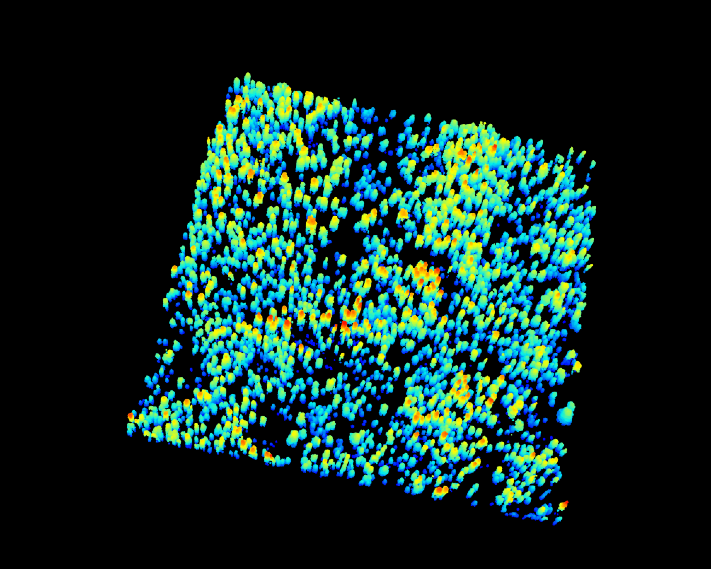
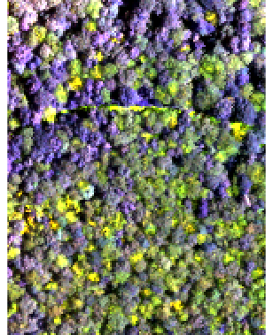
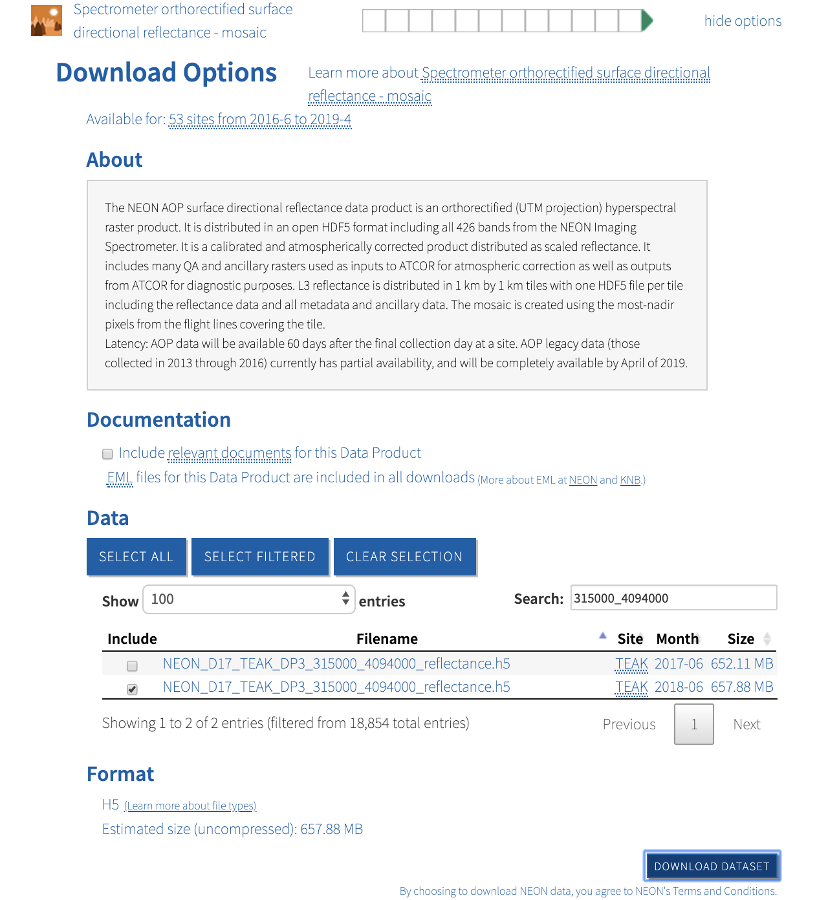

# A multi-sensor benchmark dataset for detecting individual trees in RGB and point clouds

Individual tree detection is a central task in forestry and ecology. Very few papers analyze proposed methods across a wide geographic area. This limits the utility of tools and inhibits comparisons across methods. This benchmark dataset is the first dataset to have consistant annotation approach accross a variety of ecosystems. 

Mantainer: Ben Weinstein - University of Florida.

Description: The NeonTreeEvaluation dataset is a set of bounding boxes drawn on RGB imagery from the National Ecological Observation Network (NEON). NEON is a set of 45 sites (e.g. [TEAK](https://www.neonscience.org/field-sites/field-sites-map/TEAK)) that cover the dominant ecosystems in the US.

# How were images annotated?

Each visible tree was annotated to create a bounding box that encompassed all portions of the vertical object. Fallen trees were not annotated. Visible standing stags were annotated. Trees which were judged to have less than 50% of biomass in the image edge were ignored.


For the point cloud annotations, the two dimensional bounding boxes were [draped](https://github.com/weecology/DeepLidar/blob/b3449f6bd4d0e00c24624ff82da5cfc0a018afc5/DeepForest/postprocessing.py#L13) over the point cloud, and all non-ground points (height < 2m) were excluded. Minor cosmetic cleanup was performed to include missing points. In general, the point cloud annotations should be seen as less thoroughly cleaned, given the tens of thousands of potential points in each image.

# Sites ([NEON locations](https://www.neonscience.org/field-sites/field-sites-map/list))

SJER: "Located at The San Joaquin Experimental Range, in the western foothills of the Sierra Nevada, this 18.2 kilometer terrestrial field site is a mix of open woodlands, shrubs and grasslands with low density cattle grazing." 
* 2533 training trees,	293 test trees

TEAK: "The site encompasses 5,138 hectares (12,696 acres) of mixed conifer and red fir forest, ranging in elevation from 1,990 to 2,807 m (6,529 – 9,209ft). The varied terrain is typical of the Sierra Nevada, with rugged mountains, meadows and prominent granite outcrops." 

* 3405 training tees,	747 test trees.

NIWO: The “alpine” site is Niwot Ridge Mountain Research State, Colorado (40.05425, -105.58237). This high elevation site (3000m) is near treeline with clusters of Subalpine Fir (Abies lasciocarpa) and Englemann Spruce (Picea engelmanii). Trees are very small compared to the others sites.

* 9730 training trees, 1699 test trees.

MLBS: The “Eastern Deciduous” site is the Mountain Lake Biological Station. Here the dense canopy is dominated by Red Maple (Acer rubrum) and White Oak (Quercus alba). 

* 1231 training trees,	489 test trees.

# How do I load the dataset?

The following tools are useful for interacting with this dataset. 
## Python

* pyfor / laspy
* rasterio

## R

* lidR
* raster

# Example
```
library(raster)
library(lidR)

rgb<-stack("data/NeonTreeEvaluation/SJER/SJER_005.tif")
plotRGB(rgb)

laz<-readLAS("data/NeonTreeEvaluation/SJER/SJER_005.laz")
plot(laz)
```


For more guidance on data loading, see /utilities.

# How can I add to this dataset?

Anyone is welcome to add to this dataset by cloning this repo and labeling a new site in [rectlabel](https://rectlabel.com/). NEON data is available on the [NEON data server](http://data.neonscience.org/home). We used the NEON 2018 “classified LiDAR point cloud” data
104 product (NEON ID: DP1.30003.001), and the “orthorectified camera mosaic” (NEON ID:
105 DP1.30010.001). Please follow the current folder structure, with .laz and .tif files saved together in a single folder, with a unique name, as well as a single annotations folder for the rect label xml files. See /SJER for an example.

For ease of access, we have added two unlabeled sites, [BART](https://www.neonscience.org/field-sites/field-sites-map/BART), and [UNDE](https://www.neonscience.org/field-sites/field-sites-map/UNDE), we encourage others to label these sites, or use models from the labeled data to predict into new, untested, areas. 

# Lidar

To access the draped lidar hand annotations, use the "label" column. Each tree has a unique integer.

```
> r<-readLAS("TEAK/training/NEON_D17_TEAK_DP1_315000_4094000_classified_point_cloud_colorized_crop.laz")
23424 points below 0 found.
> trees<-lasfilter(r,!label==0)
> plot(trees,color="label")
```



We elected to keep all points, regardless of whether they correspond to tree annotation. Non-tree points have value 0. We highly recommend removing these points before predicting the point cloud. Since the annotations were made in the RGB and then draped on to the point cloud, there will naturally be some erroneous points at the borders of trees.

# Hyperspectral 
For the convienance of future users, we have downloaded, cropped and selected reasonable three band combinations for NEON hyperspectral images. 

```
> r<-stack("/Users/Ben/Documents/NeonTreeEvaluation/MLBS/training/2018_MLBS_3_541000_4140000_image_crop_false_color.tif")
> nlayers(r)
[1] 3
> plotRGB(r,stretch="lin")
```



For the full tiles and bands, see the NEON Data Portal. For example, for the TEAK training file

```
TEAK/Training/2018_TEAK_3_315000_4094000_image_crop.tif
```


## Additional info

### Large Files

There is one ugly part of mantaining a benchmark on github. Some training files are too large to hold on the repo. For example, full tiles are available directly from NEON. For example, the annotations that match
```
SJER/annotations/2018_SJER_3_258000_4106000_image.xml 
```
should be 

```
SJER/training/2018_SJER_3_259000_4110000_image.tif, 
```
but are too large to be placed here. Instead, they can be directly downloaded from https://data.neonscience.org/home (see screenshot above) or are directly hosted by the mantainer below. 

If you would prefer not to clone this repo, a static version of the benchmark is here: [insert url later]

* TEAK training RGB and lidar tile https://www.dropbox.com/s/tzduobrzzpji8ps/2018_TEAK_3_315000_4094000_image_crop.tif?dl=1
https://www.dropbox.com/s/5x629zfd7o3cv8g/NEON_D17_TEAK_DP1_315000_4094000_classified_point_cloud_colorized_crop.laz?dl=1

* SJER training laz 1 https://www.dropbox.com/s/i8edrp4derzxwtb/NEON_D17_SJER_DP1_259000_4110000_classified_point_cloud_colorized.laz?dl=1

* SJER training laz 2 https://www.dropbox.com/s/mn2sx4e1u5p4chx/NEON_D17_SJER_DP1_258000_4106000_classified_point_cloud_colorized.laz?dl=1

Download using wget into the correct position for example
```
[b.weinstein@login3 training]$ pwd
/home/b.weinstein/DeepLidar/data/TEAK/training
[b.weinstein@login3 training]$ ls
2018_TEAK_3_315000_4094000_image_crop.tif?dl=1
NEON_D17_TEAK_DP1_315000_4094000_classified_point_cloud_colorized_crop.laz
```

then *rename* to drop the wget artifact. 

```
[b.weinstein@login3 training]$ mv 2018_TEAK_3_315000_4094000_image_crop.tif?dl=1 2018_TEAK_3_315000_4094000_image_crop.tif
[b.weinstein@login3 training]$ ls
2018_TEAK_3_315000_4094000_image_crop.tif  NEON_D17_TEAK_DP1_315000_4094000_classified_point_cloud_colorized_crop.laz
[b.weinstein@login3 training]$
```

We recognize that this is not ideal, but worth the collaborative environment that git provides.

# Performance

The following papers report statistics for performance at one or more sites.

Weinstein, Ben G., et al. "Individual tree-crown detection in RGB imagery using semi-supervised deep learning neural networks." Remote Sensing 11.11 (2019): 1309.

* https://www.mdpi.com/2072-4292/11/11/1309

Please submit a pull request, or contact the mantainer if you use these data in analysis and would like the results to be shown here.
