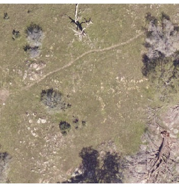
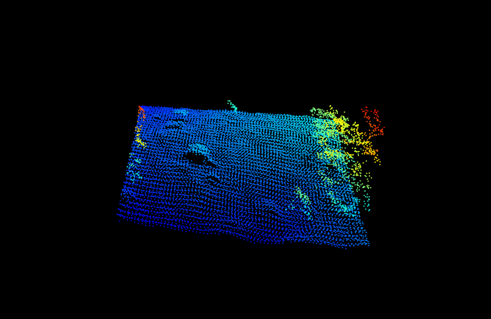

# A benchmark dataset for trees in RGB and point clouds.

Individual tree detection is a central task in forestry and ecology. Very few papers analyze proposed methods across a wide geographic area. This limits the utility of tools and inhibits comparisons across methods. This benchmark dataset is the first dataset to have consistant annotation approach accross a variety of ecosystems. 

Mantainer: Ben Weinstein - University of Florida.

Description: The NeonTreeEvaluation dataset is a set of bounding boxes drawn on RGB imagery from the National Ecological Observation Network (NEON). NEON is a set of 45 sites (e.g. [TEAK](https://www.neonscience.org/field-sites/field-sites-map/TEAK)) that cover the dominant ecosystems in the US.

# How were images annotated?

Each visible tree was annotated to create a bounding box that encompassed all portions of the vertical object. Fallen trees were not annotated. 

<img src="figures/rectlabel.png", width="200")

For the point cloud annotations, the two dimensional bounding boxes were [draped](https://github.com/weecology/DeepLidar/blob/b3449f6bd4d0e00c24624ff82da5cfc0a018afc5/DeepForest/postprocessing.py#L13) over the point cloud, and all non-ground points (height < 2m) were excluded. Minor cosmetic cleanup was performed to include missing points. In general, the point cloud annotations should be seen as less thoroughly cleaned, given the tens of thousands of potential points in each image.

# Sites

SJER: "Located at The San Joaquin Experimental Range, in the western foothills of the Sierra Nevada, this 18.2 kilometer terrestrial field site is a mix of open woodlands, shrubs and grasslands with low density cattle grazing."

TEAK: "The site encompasses 5,138 hectares (12,696 acres) of mixed conifer and red fir forest, ranging in elevation from 1,990 to 2,807 m (6,529 – 9,209ft). The varied terrain is typical of the Sierra Nevada, with rugged mountains, meadows and prominent granite outcrops."

# How do I load the dataset?

The following tools are useful for interacting with this dataset. 
## Python

* pyfor / laspy
* rasterio

## R

* lidR
* raster

# Example

```
library(raster)
library(lidR)

rgb<-stack("data/NeonTreeEvaluation/SJER/SJER_005.tif")
plotRGB(rgb)

laz<-readLAS("data/NeonTreeEvaluation/SJER/SJER_005.laz")
plot(laz)
```




# Performance

The following papers report statistics for performance at one or more sites.

* https://www.biorxiv.org/content/10.1101/532952v1

# How can I add to this dataset?

Anyone is welcome to add to this dataset by cloning this repo and labeling a new site in [rectlabel](https://rectlabel.com/). NEON data is available on the [NEON data server](http://data.neonscience.org/home). We used the NEON 2018 “classified LiDAR point cloud” data
104 product (NEON ID: DP1.30003.001), and the “orthorectified camera mosaic” (NEON ID:
105 DP1.30010.001). Please follow the current folder structure, with .laz and .tif files saved together in a single folder, with a unique name, as well as a single annotations folder for the rect label xml files. See /SJER for an example.


