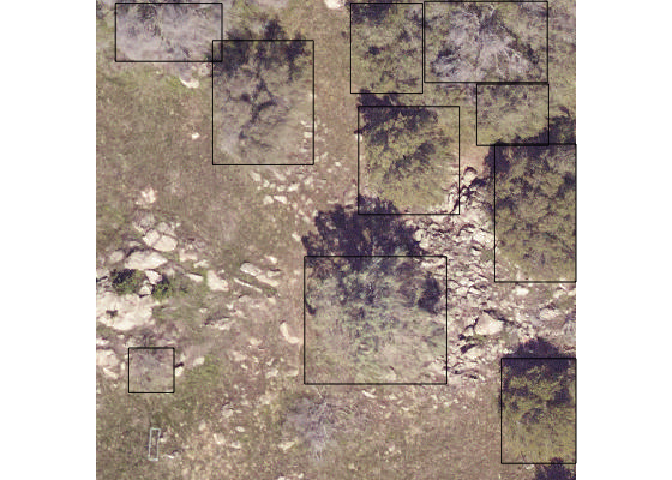

How to read and view xml annotations from the NEONTreeEvaluation benchmark dataset


```r
#Path to dataset
xmls<-readTreeXML(path="../")

#View one plot's annotations as polygons
xml_polygons <- xml_to_spatial_polygons(xmls[xmls$filename %in% "TEAK_062.tif",])
plot(xml_polygons)
```

<!-- -->
# Overlay on imagery

# Open LAS

# View annotations
